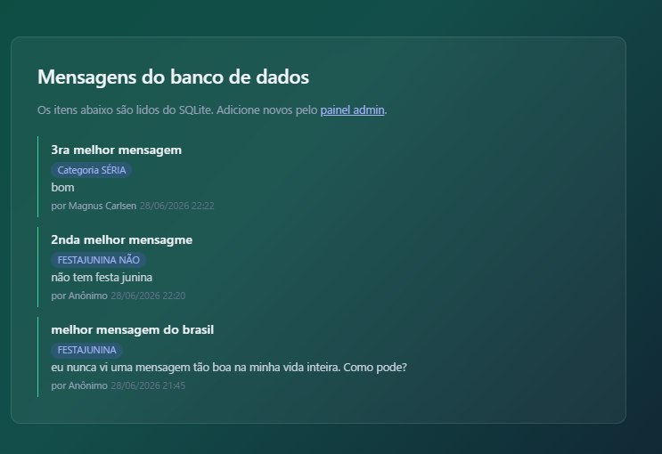
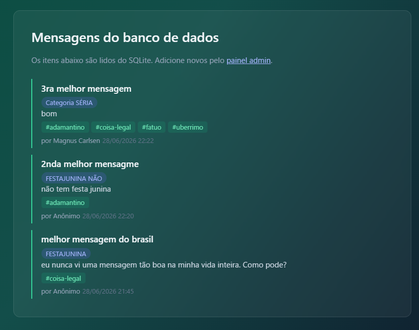
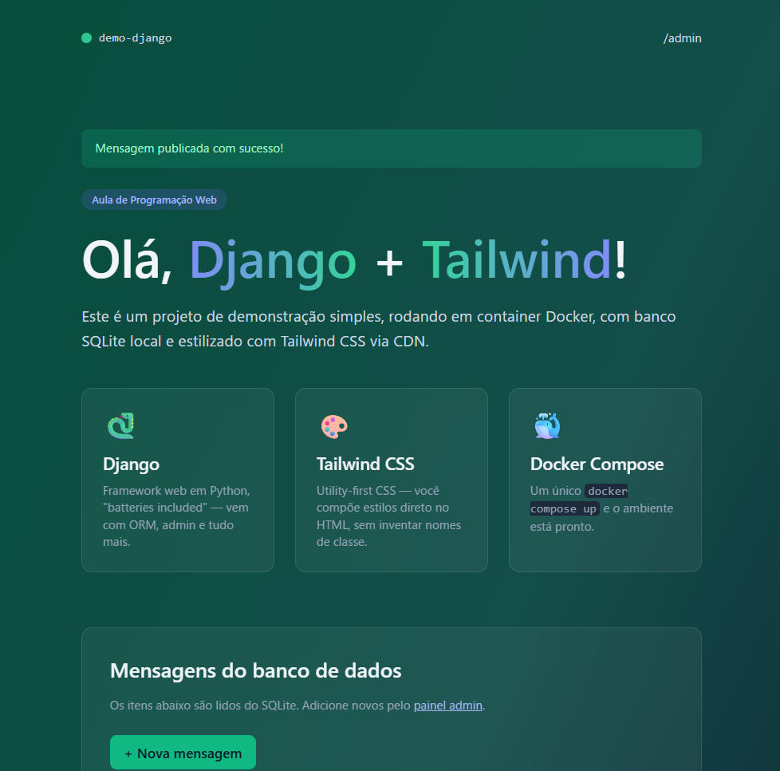
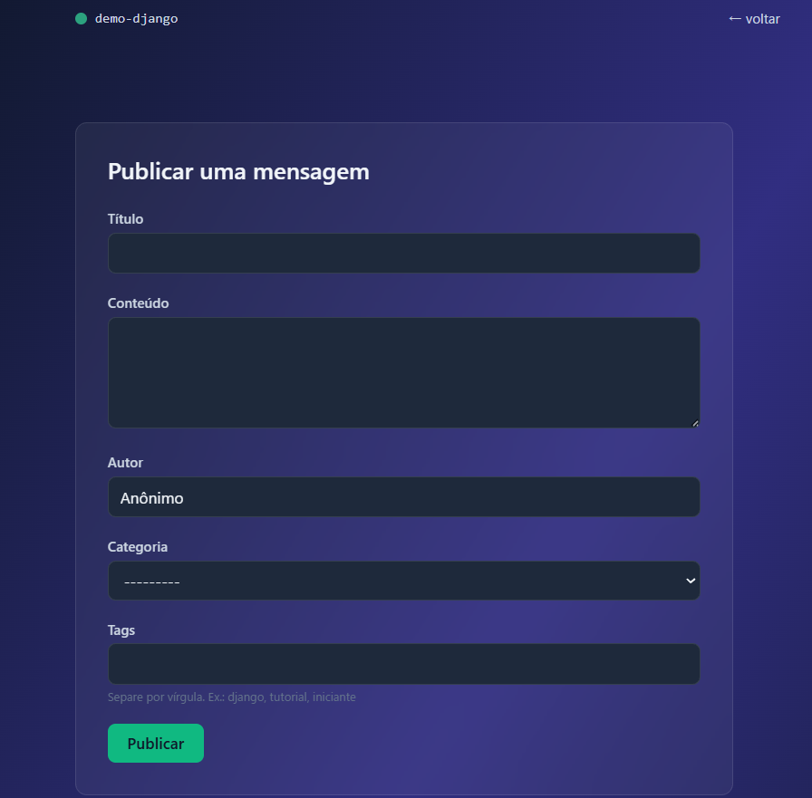
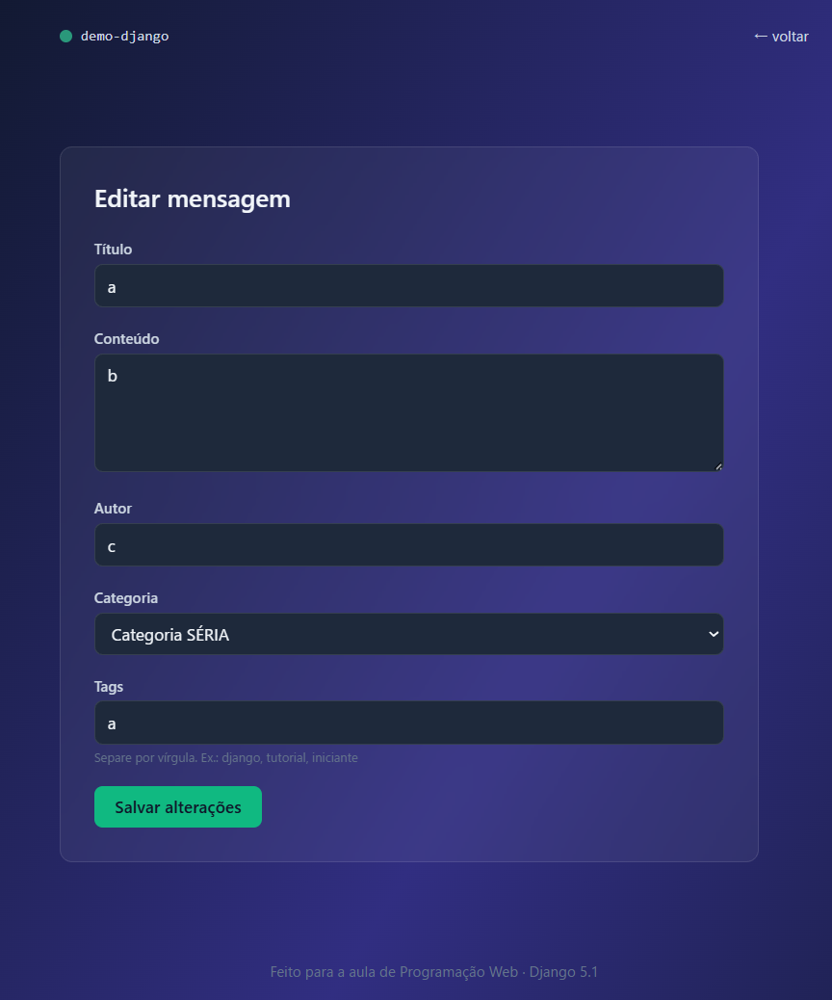
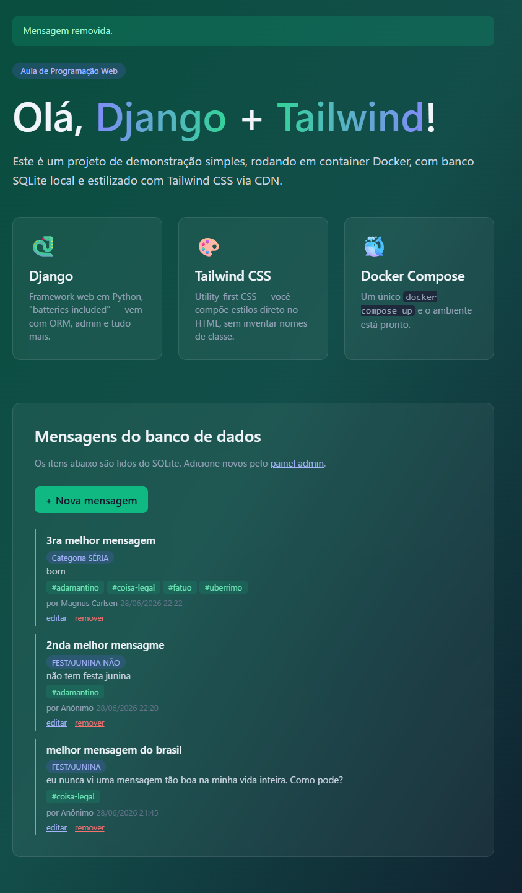
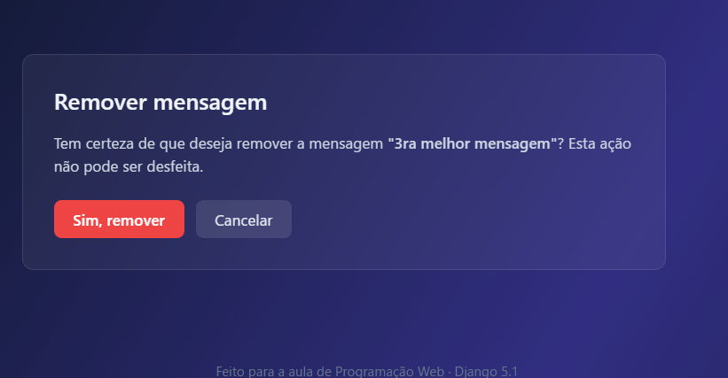

# Django-demo

Projeto de demonstração de setup página WEB em Django~

# Resultado (execução)

## Página Principal

## _Sobre_

## Parte 3

## Parte 4

## Parte 5

### Página principal

### Página de publicar mensagem

## Parte 6

### Editar mensagem

### Página principal após remoção

### Remover mensagem

